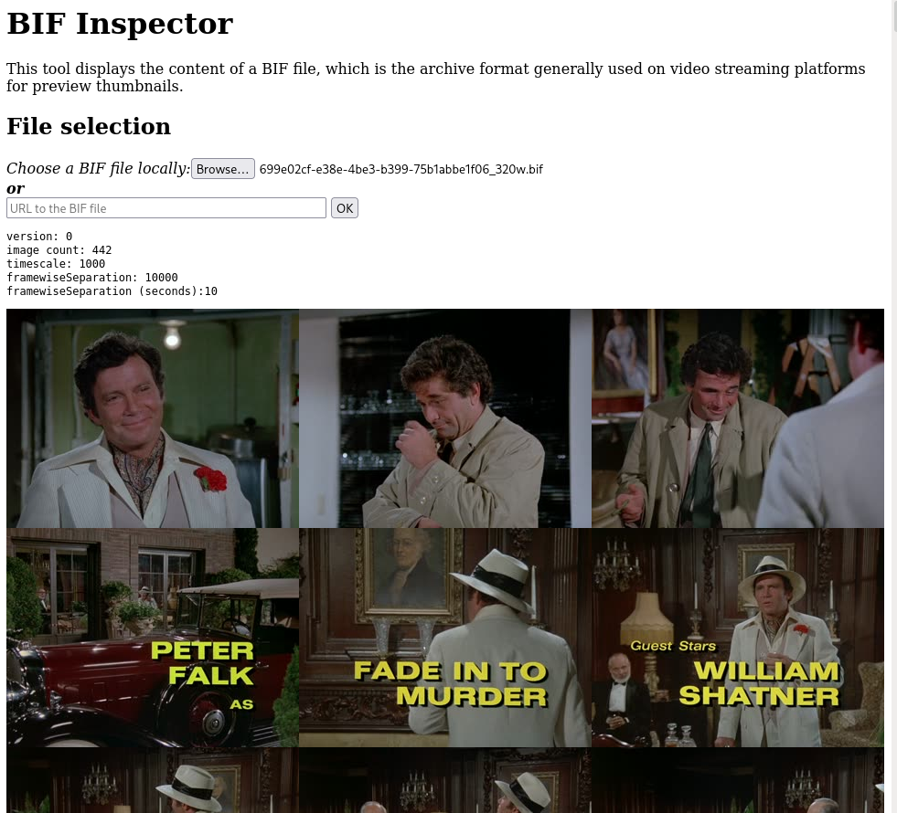

# Bif Inspector

The bif-inspector is a tool allowing to inspect the inside of BIF files, which are thumbnails archives used by many video streaming platforms (Canal+, Amazon Prime Video, Disney+, Telecom Italia...).

You can use it directly on the GitHub page linked to the project: https://peaberberian.github.io/bif-inspector/

## Screenshot

Example of the tool, running on some Columbo episode:

